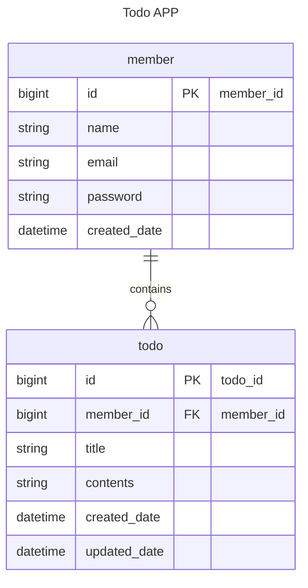

#  🗓️ JPA를 활용한 일정 관리 API 만들기
## ❔프로젝트 정보
- JPA, 3 Layer Architecture를 활용한 '일정 관리 API 만들기' 과제입니다.<br>
  이 프로젝트는 사용자가 일정을 추가, 조회, 수정, 삭제할 수 있는 API를 구현했으며, 로그인 기능을 제공합니다.
- **개발기간**: 24.12.13~24.12.19

## 🔧사용 기술
**Environment**


**Development**

 


## 📚 ERD

- 구현은 Lv6 까지 완료 하였습니다.

### Lv6 ERD



## 🧾API 명세서

### 회원 API

| 기능       | Http Method | Path            | request Body                                                                                     | Response Body                                                                                                                                                                                                                                                                                                                                                                                                                                                         | Http Status                                                                                                                             |
|----------|-------------|-----------------|--------------------------------------------------------------------------------------------------|-----------------------------------------------------------------------------------------------------------------------------------------------------------------------------------------------------------------------------------------------------------------------------------------------------------------------------------------------------------------------------------------------------------------------------------------------------------------------|-----------------------------------------------------------------------------------------------------------------------------------------|
| 회원 가입    | POST        | /members/signup | {<br>“name”: “String”,<br>“email”: “String”,<br>“password”: ”String”<br>}                        | //성공<br>{<br>“id”: “Number”,<br>“name”: “String”,<br>“email”: “String”,<br>“createdDate”: “DateTime”<br>}<br><br>//잘못된 요청 형식<br>{<br>"status": "BAD_REQUEST",<br>"message": "String",<br>"errorMessageList": “String[]”<br>}<br><br>//실패(URL 문제)<br>{<br>"timestamp": "String",<br>"status": 404,<br>"error": "Not Found"<br>"path": "String"<br>}                                                                                                                    | //성공<br>201 Created<br><br>//잘못된 요청 형식<br>400 Bad Request<br><br>//실패(URL 문제)<br>404 Not Found                                          |
| 회원 전체 조회 | GET         | /members        | -                                                                                                | //성공<br>[<br>{<br>“id”: “Number”,<br>“name”: “String”,<br>“email”: “String”,<br>“createdDate”: “DateTime”<br>},<br>{<br>“id”: “Number”,<br>“name”: “String”,<br>“email”: “String”,<br>“createdDate”: “DateTime”<br>}<br>]<br><br>// 데이터 없음<br>{<br>“status”: “OK”,<br>“message”: “String”<br>"errorMessageList": null}<br><br>//미인증<br>”String”<br><br>//실패(URL 문제)<br>{<br>"timestamp": "String",<br>"status": 404,<br>"error": "Not Found"<br>"path": "String"<br>} | //성공 or 반환할 데이터 없음<br>200 OK<br><br>//미인증<br>401 Unauthorized<br><br>//실패(URL 문제)<br>404 Not Found                                      |
| 단일 회원 조회 | GET         | /members/{id}   | -                                                                                                | //성공<br>{<br>“id”: “Number”,<br>“name”: “String”,<br>“email”: “String”,<br>“createdDate”: “DateTime”<br>}<br><br>// 데이터 없음<br>{<br>“status”: “OK”,<br>“message”: “String”<br>"errorMessageList": null}<br><br>//미인증<br>”String”<br><br>//실패(URL 문제)<br>{<br>"timestamp": "String",<br>"status": 404,<br>"error": "Not Found"<br>"path": "String"<br>}                                                                                                                 | //성공 or 반환할 데이터 없음<br>200 OK<br><br>//미인증<br>401 Unauthorized<br><br>//실패(URL 문제)<br>404 Not Found                                      |
| 회원 정보 수정 | PATCH       | /members/{id}   | //변경하지 않을 정보 입력 불필요<br>{<br>“name”: “String”,<br>“email”: “String”,<br>“password”: ”String”<br>} | //성공<br>{<br>“id”: “Number”,<br>“name”: “String”,<br>“email”: “String”,<br>“createdDate”: “DateTime”<br>}<br><br>//잘못된 요청 형식<br>{<br>"status": "BAD_REQUEST",<br>"message": "String",<br>"errorMessageList": “String[]”<br>}<br><br>//미인증<br>”String”<br><br>//실패(URL 문제)<br>{<br>"timestamp": "String",<br>"status": 404,<br>"error": "Not Found"<br>"path": "String"<br>}                                                                                           | //성공<br>201 Created<br><br>//잘못된 요청 형식<br>400 Bad Request<br><br>//미인증<br>401 Unauthorized<br><br>//실패(URL 문제)<br>404 Not Found<br><br> |
| 회원 삭제    | DELETE      | /members/{id}   | -                                                                                                | //삭제하려는 데이터 없음<br>{<br>“status”: “OK”,<br>“message”: “String”<br>"errorMessageList": null<br>}<br><br>//미인증<br>”String”<br><br>//실패(URL 문제)<br>{<br>"timestamp": "String",<br>"status": 404,<br>"error": "Not Found"<br>"path": "String"<br>}                                                                                                                                                                                                                         | //성공<br>204 No Content<br><br>//반환할 데이터 없음<br>200 OK<br><br>//실패(URL 문제)<br>404 Not Found                                               |                                                                                                                                                                                                                            

<br>

### 일정 API

| 기능       | Method | Path        | Request                                                                                         | Response                                                                                                                                                                                                                                                                                                                                                                                                                                                                                                                                                                                    | Status                                                                                                                                |
|----------|--------|-------------|-------------------------------------------------------------------------------------------------|---------------------------------------------------------------------------------------------------------------------------------------------------------------------------------------------------------------------------------------------------------------------------------------------------------------------------------------------------------------------------------------------------------------------------------------------------------------------------------------------------------------------------------------------------------------------------------------------|---------------------------------------------------------------------------------------------------------------------------------------|
| 일정 생성    | POST   | /todos/save | {<br>“name”: “String”,<br>“title”: “String”,<br>“contents”: ”String”,<br>“email”: “String”<br>} | //성공<br>{<br>“id”: “Number”,<br>“name”: “String”,<br>"title": "String",<br>“contents”: “String”,<br>“created_date”: “DateTime”,<br>“updated_date”: “DateTime”<br>}<br><br>//실패(URL 문제)<br>{<br>"timestamp": "String",<br>"status": 404,<br>"error": "Not Found"<br>"path": "String"<br>}<br><br>//미인증<br>”String”<br><br>//잘못된 요청 형식<br>{<br>"status": "BAD_REQUEST",<br>"message": "String",<br>"errorMessageList": “String[]”<br>}                                                                                                                                                        | //일정 추가 성공<br>201 Created<br><br>//실패(URL 문제)<br>404 Not Found<br><br>//미인증<br>401 Unauthorized<br><br>//잘못된 요청 형식<br>400 Bad Request |
| 일정 전체 조회 | GET    | /todos      | -                                                                                               | //성공<br>[<br>{<br>“id”: “Number”,<br>  “name”: “String”,<br>“title”: “String”,<br>“contents”: “String”,<br>“createdDate”: “DateTime”,<br>“updatedDate”: “DateTime”<br>},<br>{<br>“id”: “Number”,<br>  “name”: “String”,<br>“title”: “String”,<br>“contents”: “String”,<br>“createdDate”: “DateTime”,<br>“updatedDate”: “DateTime”<br>}<br>]<br><br>// 데이터 없음<br>{<br>“status”: “OK”,<br>“message”: “String”<br>"errorMessageList": null<br>}<br><br>//미인증<br>”String”<br><br>//실패(URL 문제)<br>{<br>"timestamp": "String",<br>"status": 404,<br>"error": "Not Found"<br>"path": "String"<br>} | //성공 or 반환할 데이터 없음<br>200 OK<br><br>//미인증<br>401 Unauthorized<br><br>//실패(URL 문제)<br>404 Not Found                                    |                                                                                                 
| 단일 일정 조회 | GET    | /todos/{id} | -                                                                                               | //성공<br>{<br>“id”: “Number”,<br>“name”: “String”,<br>"title": "String",<br>“contents”: “String”,<br>“created_date”: “DateTime”,<br>“updated_date”: “DateTime”<br>}<br><br>// 데이터 없음<br>{<br>“status”: “OK”,<br>“message”: “String”<br>"errorMessageList": null<br>}<br><br>//실패(URL 문제)<br>{<br>"timestamp": "String",<br>"status": 404,<br>"error": "Not Found"<br>"path": "String"<br>}<br><br>//미인증<br>”String”                                                                                                                                                                          | //성공 or 찾는 데이터 없음<br>200 OK<br><br>//실패(URL 문제)<br>404 Not Found<br><br>//미인증<br>401 Unauthorized                                     |
| 일정 수정    | PUT    | /todos/{id} | {<br>"title": "String",<br>"contents": "String"<br>}                                            | //성공<br>{<br>“id”: “Number”,<br>“name”: “String”,<br>"title": "String",<br>“contents”: “String”,<br>“created_date”: “DateTime”,<br>“updated_date”: “DateTime”<br>}<br><br>//잘못된 요청 형식<br>{<br>"status": "BAD_REQUEST",<br>"message": "String",<br>"errorMessageList": “String[]”<br>}<br><br>//실패(URL 문제)<br>{<br>"timestamp": "String",<br>"status": 404,<br>"error": "Not Found"<br>"path": "String"<br>}<br><br>//미인증<br>”String”                                                                                                                                                        | //성공<br>200 OK<br><br>//잘못된 요청 형식<br>400 Bad Request<br><br>//실패(URL 문제)<br>404 Not Found<br><br>//미인증<br>401 Unauthorized            |                                                                                                                                       
| 일정 삭제    | DELETE | /todos/{id} | -                                                                                               | //삭제하려는 데이터 없음<br>{<br>“status”: “OK”,<br>“message”: “String”<br>"errorMessageList": null}<br><br>//미인증<br>”String”<br><br>//실패(URL 문제)<br>{<br>"timestamp": "String",<br>"status": 404,<br>"error": "Not Found"<br>"path": "String"<br>}                                                                                                                                                                                                                                                                                                                                                   | //성공<br>204 No Content<br><br>//삭제할 데이터 없음<br>200 OK<br><br>//실패(URL 문제)<br>404 Not Found                                             |

<br>

### 로그인 API
| 기능    | Method | Path    | Request                                              | Response                                                                                                                                                                                                                                  | Status                                                                                    |
|-------|--------|---------|------------------------------------------------------|-------------------------------------------------------------------------------------------------------------------------------------------------------------------------------------------------------------------------------------------|-------------------------------------------------------------------------------------------|
| 로그인   | POST   | /login  | {<br>"email": "String",<br>"password": "String"<br>} | //잘못된 요청 형식<br>{<br>"status": "BAD_REQUEST",<br>"message": "String",<br>"errorMessageList": “String[]”<br>}<br><br>//실패(URL 문제)<br>{<br>"timestamp": "String",<br>"status": 404,<br>"error": "Not Found"<br>"path": "String"<br>}<br><br> | //성공<br>200 OK<br><br>//잘못된 요청 형식<br>400 Bad Request<br><br>//실패(URL 문제)<br>404 Not Found |
| 로그 아웃 | POST   | /logout | -                                                    | -                                                                                                                                                                                                                                         | //성공<br>200 OK                                                                            |

<br>

## 🗂️ DB 테이블 설명

### 🔹Table: member

- 설명: 회원 정보를 저장하는 테이블
- 컬럼:
    - ```id```: 회원 고유 식별자 (PRIMARY KEY, auto increment)
    - ```name```: 회원 이름 (@NotBlank, max=10)
    - ```email```: 회원 이메일 (@NotBlank, unique = true)
    - ```password```: 비밀번호 (@NotBlank)
    - ```created_date```: 회원 가입일 (DATETIME)

<br>

### 🔹Table: todo

- 설명: 일정 정보를 저장하는 테이블
- 컬럼:
    - ```id```: 일정 고유 식별자 (PRIMARY KEY, auto increment)
    - ```member_id```: 회원 고유 식별자 (FOREIGN KEY)
    - ```title```: 일정 제목 (@NotBlank, max=50)
    - ```contents```: 세부 일정 (@NotBlank, max=200)
    - ```created_date```: 작성일 (DATETIME)
    - ```updated_date```: 수정일 (DATETIME)
  
<br>

### 🔹부가 설명
- 가입일, 작성일은 변경되지 않습니다.
- 수정일은 수정사항 발생시 자동 갱신됩니다.
- 비밀번호는 암호화되어 저장됩니다.

<br>

## 🧩파일 경로 안내
- 기능 관련 코드는 src > main > java/com/example/newtodoapp 에서 확인할 수 있습니다.

