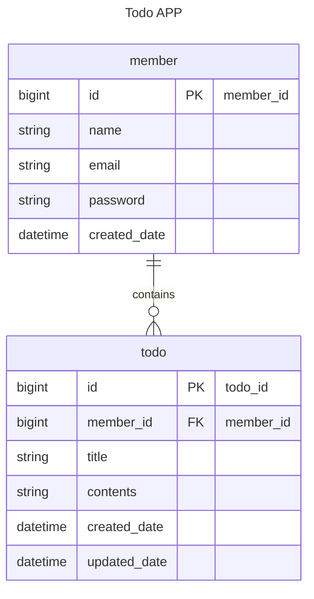

#  🗓️ JPA를 활용한 일정 관리 API 만들기
## ❔프로젝트 정보
- JPA, 3 Layer Architecture를 활용한 '일정 관리 API 만들기' 과제입니다.<br>
  이 프로젝트는 사용자가 일정을 추가, 조회, 수정, 삭제할 수 있는 API를 구현했으며, 로그인 기능을 제공합니다.
- **개발기간**: 24.12.13~24.12.19

## 🔧사용 기술
**Environment**


**Development**

 


## 📚 ERD

- 구현은 Lv6 까지 완료 하였습니다.

### Lv6 ERD



## 🧾API 명세서

### 회원 API
[Member API Doc](./MemberAPI.md)

<br>

### 일정 API
[TODO API Doc](./TodoAPI.md)

<br>

### 로그인 API
[Login API Doc](./LoginAPI.md)

<br>

## 🗂️ DB 테이블 설명

### 🔹Table: member

- 설명: 회원 정보를 저장하는 테이블
- 컬럼:
    - ```id```: 회원 고유 식별자 (PRIMARY KEY, auto increment)
    - ```name```: 회원 이름 (@NotBlank, max=10)
    - ```email```: 회원 이메일 (@NotBlank, unique = true)
    - ```password```: 비밀번호 (@NotBlank)
    - ```created_date```: 회원 가입일 (DATETIME)

<br>

### 🔹Table: todo

- 설명: 일정 정보를 저장하는 테이블
- 컬럼:
    - ```id```: 일정 고유 식별자 (PRIMARY KEY, auto increment)
    - ```member_id```: 회원 고유 식별자 (FOREIGN KEY)
    - ```title```: 일정 제목 (@NotBlank, max=50)
    - ```contents```: 세부 일정 (@NotBlank, max=200)
    - ```created_date```: 작성일 (DATETIME)
    - ```updated_date```: 수정일 (DATETIME)
  
<br>

### 🔹부가 설명
- 가입일, 작성일은 변경되지 않습니다.
- 수정일은 수정사항 발생시 자동 갱신됩니다.
- 비밀번호는 암호화되어 저장됩니다.

<br>

## 🧩파일 경로 안내
- 기능 관련 코드는 src > main > java/com/example/newtodoapp 에서 확인할 수 있습니다.

